<p align="center">
  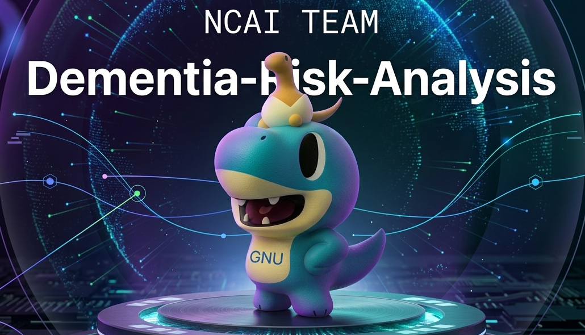
</p>

# 음성 인식 치매 위험도 분석 시스템

경상국립대학교 기업형 캡스톤디자인 프로젝트로 개발한 음성 기반 인지 위험도 모니터링 시스템이다.  
사용자의 음성 발화를 텍스트로 변환한 뒤, 답변 생성과 언어 특징 분석을 분리 수행하고, 그 결과를 대시보드 형태로 시각화하여 제공한다.

---

## 1. 팀 구성

본 프로젝트는 경상국립대학교 캡스톤디자인 NCAI팀이 수행한 결과물로, 음성 인식, 언어 분석, 웹 대시보드 시각화, 세션 기반 모니터링 기능을 하나의 시스템으로 통합하는 데 초점을 두었습니다.  
팀원들은 AI 응답 생성, 역할별 분석 로직, 프론트엔드 대시보드 구성, 시각 자료 정리까지 전반적인 시스템 구현을 함께 수행했습니다.

| 이름       | Role                                                             |
| ---------- | ---------------------------------------------------------------- |
| **김도윤** | Web Frontend · Backend Development                               |
| **조재민** | Mobile Application Development · Database Design                 |
| **김우성** | Robotics Implementation · Documentation · Performance Validation |
| **안재영** | Robotics Implementation · Prompt Engineering                     |

---

## 2. 프로젝트 개요

본 프로젝트는 일상 대화에서 나타나는 언어적 특징을 바탕으로, 인지 위험 신호를 보조적으로 관찰할 수 있는 웹 기반 모니터링 시스템을 구현하는 것을 목표로 한다.

기존의 인지 관련 평가는 병원 방문 이후에 이루어지거나, 별도의 검사 환경 안에서 제한적으로 수행되는 경우가 많다.  
본 시스템은 보다 자연스러운 음성 상호작용 환경 안에서 사용자의 발화를 수집하고, 질문 반복, 기억 혼란, 시간·상황 혼란, 문장 비논리성과 같은 특징을 역할별로 분석한다.  
또한 분석 결과를 점수, 카드, 차트, 세션 기록 형태로 시각화하여 단순 응답 시스템을 넘어선 지속 관찰형 인터페이스로 확장하였다.

---

## 3. 개발 배경 및 필요성

인지 변화는 정형화된 검사 환경 이전에도 일상 대화 속 언어 사용 패턴에서 점진적으로 드러날 수 있다.  
특히 질문 반복, 최근 정보 회상 실패, 일정 및 시간 혼동과 같은 표현은 자연스러운 상호작용 안에서 먼저 관찰되는 경우가 많다.

- 음성 대화는 사용자의 실제 언어 습관과 반응 방식을 비교적 자연스럽게 반영할 수 있는 입력 수단이다.
- 인지 위험 신호는 단일 답변보다 반복되는 발화 패턴과 맥락의 누적 변화 속에서 더 분명하게 나타날 수 있다.
- 분석 결과를 수치와 시각 요소로 함께 제시하면 사용자가 상태 변화를 보다 직관적으로 이해할 수 있다.
- 단순 질의응답 시스템을 넘어, 기록과 모니터링 기능이 결합된 지속 관찰형 인터페이스가 필요하다.

---

## 4. 개발 목표

본 프로젝트는 음성 기반 상호작용과 역할별 언어 분석을 결합하여, 인지 위험 신호를 보다 직관적으로 관찰할 수 있는 웹 기반 모니터링 시스템을 구현하는 것을 목표로 한다.

- 브라우저 환경에서 음성을 수집하고 이를 안정적으로 텍스트로 변환하는 입력 흐름을 구현한다.
- 사용자 발화에 대해 자연스럽고 빠른 응답을 우선 제공하여 대화 흐름을 유지한다.
- 질문 반복, 기억 혼란, 시간·상황 혼란, 문장 비논리성을 역할별로 분리 분석한다.
- 분석 결과를 점수, 카드, 차트, 추세 정보로 시각화하여 해석 가능성을 높인다.
- 세션 단위 기록과 Recall Memory Test를 결합하여 보조 모니터링 기능을 제공한다.

---

## 5. 주요 기능

본 시스템은 음성 입력부터 응답 생성, 역할별 분석, 시각화, 세션 기록 관리까지 하나의 흐름으로 연결되는 기능 구조를 갖는다.

- 브라우저 환경에서 음성을 녹음하고 Google Speech-to-Text 기반으로 텍스트를 생성한다.
- 사용자 발화에 대해 LLM 기반 응답을 우선 생성하여 대화 흐름을 자연스럽게 유지한다.
- 질문 반복, 기억 혼란, 시간·상황 혼란, 문장 비논리성을 역할별로 분리 분석한다.
- 누적 위험 상태, 평균 점수, 최근 점수, 추세 차트를 대시보드 형태로 시각화한다.
- 채팅 기록 클릭을 통해 과거 시점의 분석 결과를 다시 확인할 수 있다.
- Recall Memory Test를 세션 흐름 안에 자동 삽입하고 결과를 별도 카드로 표시한다.
- 세션 리포트 모달과 출력 기능을 통해 분석 내용을 요약된 형태로 정리할 수 있다.
- 로컬 모델과 API 모드를 전환할 수 있도록 구성하여 실행 환경에 따른 유연성을 확보하였다.

---

## 6. 시스템 전체 구조

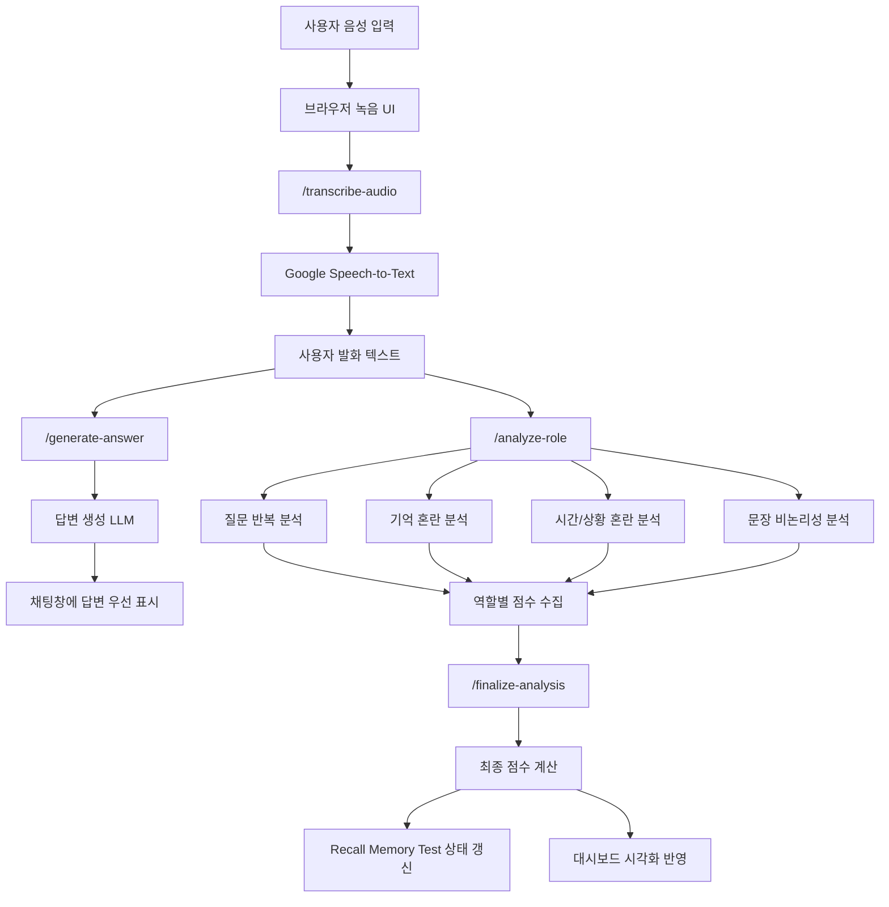

### 구조 설명

본 시스템은 `음성 입력`, `응답 생성`, `역할별 분석`, `시각화 반영`의 흐름이 하나의 연속된 사용자 경험으로 이어지도록 설계하였다.  
입력된 음성은 텍스트로 변환된 뒤, 먼저 대화 응답 생성에 사용되어 사용자와의 상호작용을 유지하고, 이어서 동일한 발화를 기반으로 세부 분석을 수행한다.

- 브라우저에서 수집된 음성은 서버로 전달된 뒤 Google Speech-to-Text를 통해 텍스트로 변환된다.
- 변환된 텍스트는 우선 답변 생성 체인으로 전달되어 채팅창에 빠르게 응답이 표시된다.
- 이후 동일한 발화는 질문 반복, 기억 혼란, 시간·상황 혼란, 문장 비논리성의 네 가지 분석 체인으로 분기된다.
- 각 체인에서 산출된 점수는 최종 점수 계산 단계로 수집되며, 세션 상태와 기억 회상 흐름까지 함께 갱신된다.
- 최종 결과는 누적 위험 상태 카드, 세션 요약, 분석 카드, 차트, 기록 영역에 반영되어 하나의 대시보드 안에서 종합적으로 제시된다.

---

## 7. 상세 동작 흐름

1. 사용자가 `녹음 시작` 버튼을 눌러 발화를 입력하면, 브라우저는 음성 데이터를 수집하여 서버로 전송한다.
2. 서버는 업로드된 음성을 텍스트로 변환하고, 이를 현재 세션의 사용자 발화로 인식한다.
3. 변환된 텍스트는 먼저 답변 생성 모델로 전달되며, 생성된 응답은 채팅창에 우선 표시된다.
4. 같은 발화는 백그라운드에서 역할별 분석 체인으로 전달되어 질문 반복, 기억 혼란, 시간·상황 혼란, 문장 비논리성 점수가 순차적으로 계산된다.
5. 역할별 점수가 모두 수집되면 최종 점수가 확정되고, 누적 위험 상태, 세션 요약, 차트, 세부 분석 카드가 함께 갱신된다.
6. 세션 흐름에 따라 Recall Memory Test가 보조 평가 단계로 자동 삽입되며, 회상 상태 역시 별도 카드에 반영된다.
7. 사용자는 과거 채팅을 선택하여 해당 시점의 분석 결과와 세션 흐름을 다시 확인할 수 있다.

---

## 8. 역할별 분석 구조

| 분석 항목      | 설명                                       | 점수 범위 |
| -------------- | ------------------------------------------ | --------- |
| 질문 반복      | 유사하거나 동일한 질문의 재등장 여부 확인  | 0 ~ 25    |
| 기억 혼란      | 최근 정보 회상 실패, 기억 공백 표현 분석   | 0 ~ 25    |
| 시간/상황 혼란 | 시간, 일정, 날짜, 현재 상황 혼동 여부 분석 | 0 ~ 30    |
| 문장 비논리성  | 문장 연결 불안정, 맥락 붕괴 여부 분석      | 0 ~ 20    |

### 총점 계산 방식

```text
최종 점수 = 질문 반복 + 기억 혼란 + 시간/상황 혼란 + 문장 비논리성
```

### 위험도 구간

- 0 ~ 19점: 정상
- 20 ~ 39점: 낮은 위험
- 40 ~ 59점: 주의 관찰
- 60 ~ 79점: 높은 위험
- 80 ~ 100점: 매우 높은 위험

---

## 9. 화면 구성

### 9.1 인터페이스 흐름

본 시스템의 인터페이스는 `좌측 요약 패널`, `중앙 대화·처리 패널`, `우측 분석 패널`의 3열 구조를 기반으로 설계하였다.  
사용자는 중앙 영역에서 음성을 입력하고 답변을 확인하며, 좌측에서는 누적 위험 상태를, 우측에서는 최신 분석 결과와 세션 기록을 동시에 확인할 수 있다.

| 메인 인터페이스                                                                                | 음성 입력 상태                                                             |
| ---------------------------------------------------------------------------------------------- | -------------------------------------------------------------------------- |
|                                                       | 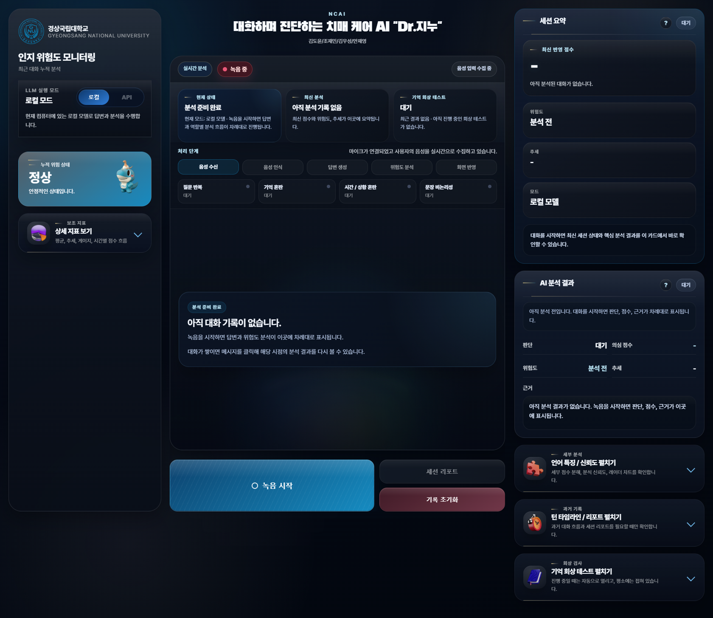                      |
| 좌·중·우 패널이 균형 있게 배치된 기본 화면으로, 누적 상태와 최신 분석을 한눈에 확인할 수 있다. | 사용자의 음성을 수집하는 동안 녹음 상태와 처리 흐름이 단계적으로 반영된다. |

| 분석 반영 단계                                                                                   | 최종 분석 결과                                                                                          |
| ------------------------------------------------------------------------------------------------ | ------------------------------------------------------------------------------------------------------- |
| 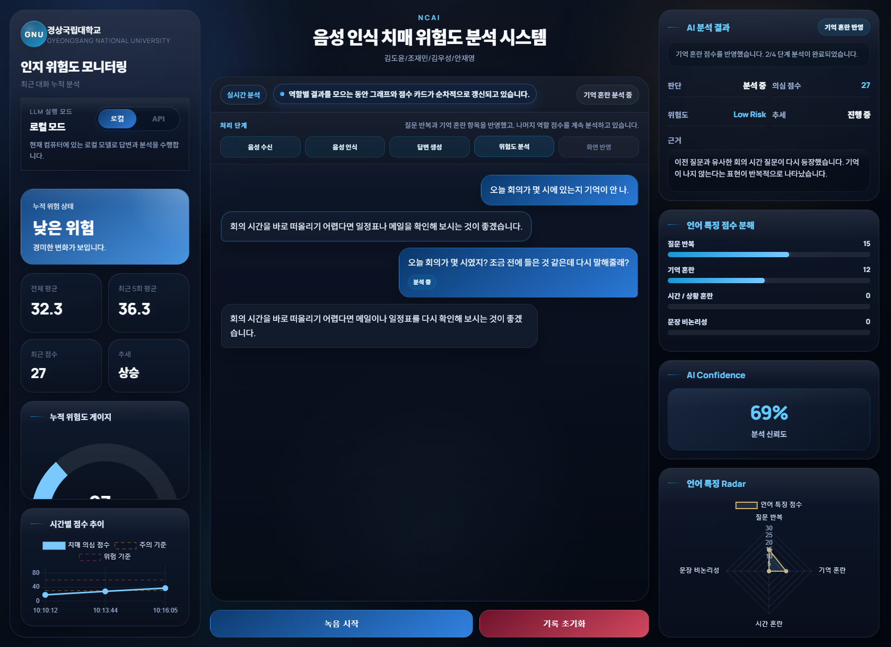                                          | 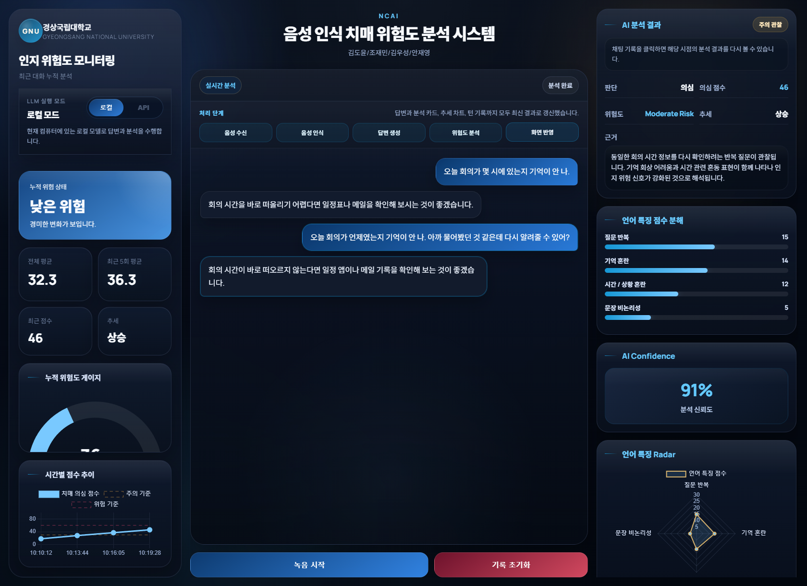                                              |
| 답변이 먼저 제시된 뒤 역할별 점수가 순차적으로 누적되며 우측 결과 패널이 함께 갱신되는 단계이다. | 최신 점수, 위험도, 추세, 세부 분석 카드가 모두 반영되어 세션 상태를 종합적으로 확인할 수 있는 화면이다. |

| 기억 회상 테스트                                                                                          |
| --------------------------------------------------------------------------------------------------------- |
| 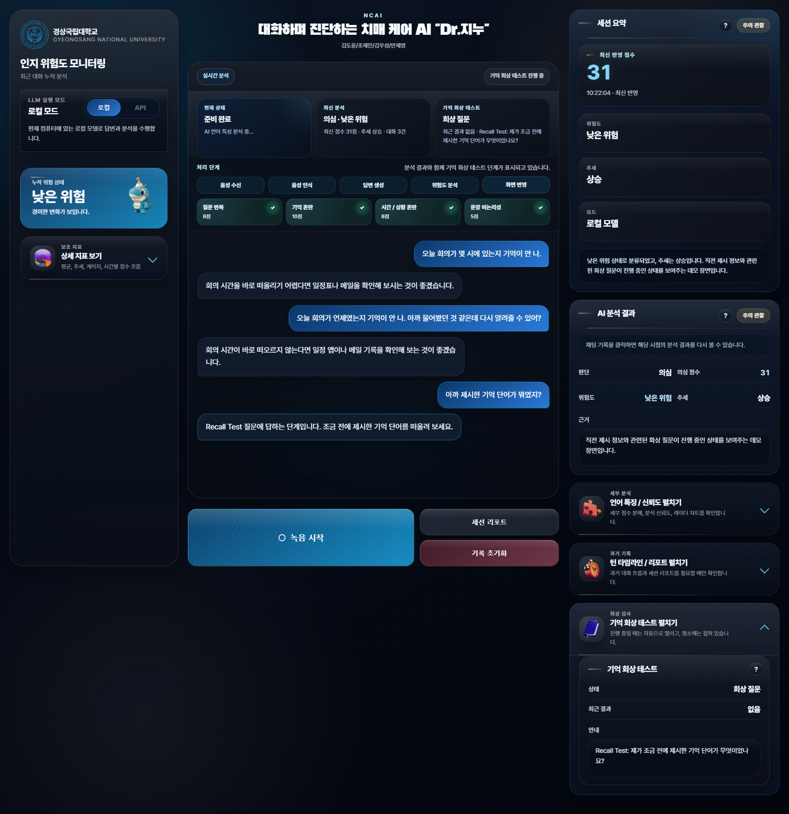                                                |
| 대화 흐름 중 보조 평가 단계로 기억 회상 테스트가 개입되며, 언어 분석과 별도로 회상 상태를 확인할 수 있다. |

### 9.2 핵심 인터페이스 카드

각 카드는 단순한 시각 요소가 아니라, `현재 상태 요약`, `언어 특징 해석`, `세션 기록 추적`이라는 목적에 따라 기능별로 분리해 설계하였다.

#### 1. 누적 위험 상태 카드


현재 세션의 누적 위험 상태를 가장 먼저 보여주는 핵심 요약 카드이다.  
위험도 단계와 보조 문구, 상태 아이콘을 함께 제시하여 사용자가 전체 상태를 직관적으로 인지할 수 있도록 구성하였다.

#### 2. 상세 지표 카드

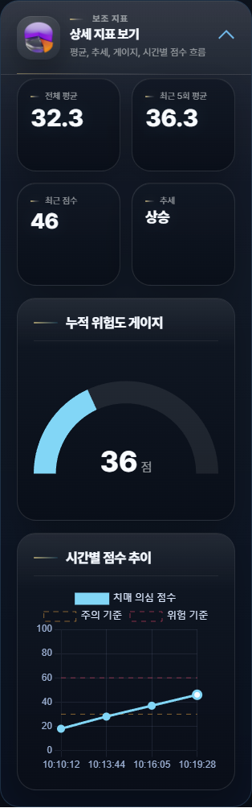

전체 평균, 최근 5회 평균, 최신 점수, 추세, 게이지, 시간별 점수 흐름을 하나의 묶음으로 제공하는 보조 지표 영역이다.  
기본 화면에서는 접은 상태로 유지하고 필요 시 확장되도록 설계하여 메인 화면의 정보 밀도를 안정적으로 제어한다.

#### 3. 처리 단계 카드


음성 수신, 음성 인식, 답변 생성, 위험도 분석, 화면 반영의 흐름을 단계형으로 보여주는 카드이다.  
역할별 분석 칩을 함께 배치하여 현재 어떤 분석이 진행 중인지, 어느 점수가 먼저 반영되었는지 직관적으로 확인할 수 있도록 하였다.

#### 4. 세션 요약 카드

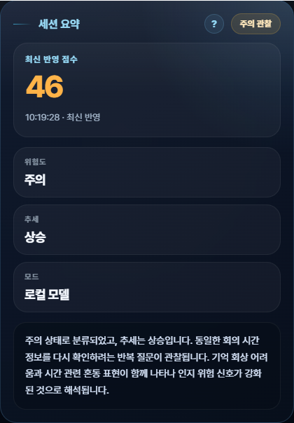

최신 반영 점수, 위험도, 추세, 실행 모드를 상단에서 즉시 확인할 수 있는 카드이다.  
실시간 모니터링 상황에서 가장 먼저 참고하게 되는 핵심 요약 영역으로 설계하였다.

#### 5. AI 분석 결과 카드

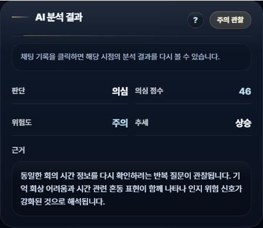

선택된 대화 턴 기준의 판단, 점수, 위험도, 추세, 근거를 제공하는 메인 분석 카드이다.  
최신 결과 확인과 과거 턴 재확인을 모두 지원하도록 구성하여, 현재 상태와 이전 분석을 같은 흐름 안에서 비교할 수 있도록 하였다.

#### 6. 언어 특징 점수 분해 카드

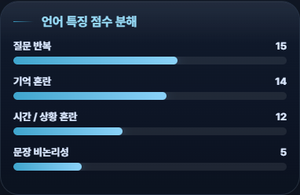

질문 반복, 기억 혼란, 시간·상황 혼란, 문장 비논리성의 세부 점수를 항목별 막대 그래프로 제시한다.  
최종 점수가 어떤 언어 특징에서 형성되었는지 설명하는 구조적 해석 카드이다.

#### 7. 분석 신뢰도 카드

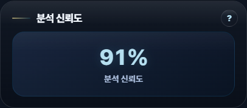

현재 분석 결과의 신뢰도를 별도 카드로 제공하여, 수치 결과와 함께 해석 안정성을 보조적으로 확인할 수 있도록 하였다.  
주요 분석 카드와 자연스럽게 이어지도록 간결한 정보 구조를 유지한다.

#### 8. 턴 타임라인 / 리포트 카드

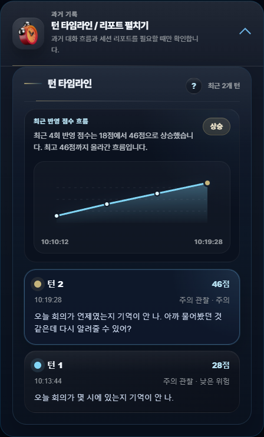

과거 대화의 점수 흐름과 세션 리포트 진입 기능을 묶어 제공하는 기록 관리 카드이다.  
세션의 변화 흐름을 확인하고, 전체 분석 내용을 리포트 형태로 정리할 수 있도록 설계하였다.

#### 9. 기억 회상 테스트 카드

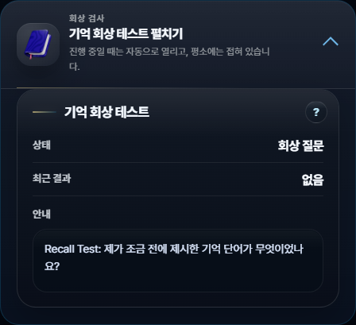

Recall Memory Test의 현재 상태, 최근 결과, 안내 문구를 표시하는 보조 평가 카드이다.  
언어 기반 위험도 분석과 별도로 기억 회상 흐름을 자연스럽게 연결하는 인터페이스 역할을 수행한다.

---

## 10. 기대 효과

- 일상 대화 기반의 자연스러운 인지 위험 신호 관찰 가능
- 역할별 분석 구조를 통한 직관적인 결과 해석 지원
- 차트와 카드 중심 대시보드를 통한 시각적 전달력 강화
- 기록 관리와 모니터링 기능이 결합된 시스템 구현

---

## 11. 기술 스택

### Frontend

- HTML
- CSS
- JavaScript
- Chart.js

### Backend

- Python
- Flask
- Waitress
- LangChain
- llama-cpp-python

### AI / Cloud

- Google Speech-to-Text
- GGUF 기반 로컬 LLM
- 외부 API 기반 LLM 전환 구조 지원

---

## 12. 프로젝트 구조

```text
ncai-dementia-risk-monitor/
├─ app.py
├─ requirements.txt
├─ README.md
├─ start_server.bat
├─ package.json
├─ lint.bat
├─ format.bat
├─ docs/
│  └─ images/
├─ models/
├─ ncai_app/
│  ├─ config.py
│  ├─ llm_service.py
│  ├─ analysis_service.py
│  ├─ history_service.py
│  ├─ routes.py
│  ├─ runtime.py
│  └─ common.py
├─ scripts/
├─ static/
│  ├─ script.js
│  ├─ style.css
│  └─ 3d-icons/
└─ templates/
   └─ index.html
```

---

## 13. 실행 방법

### 1. 패키지 설치

```bash
pip install -r requirements.txt
npm install
```

### 2. 서버 실행

```bash
python app.py
```

또는

```bash
start_server.bat
```

### 3. 접속

같은 네트워크 내 다른 기기에서는 다음 주소로 접속할 수 있다.

```text
http://서버PC_IP:5000
```
