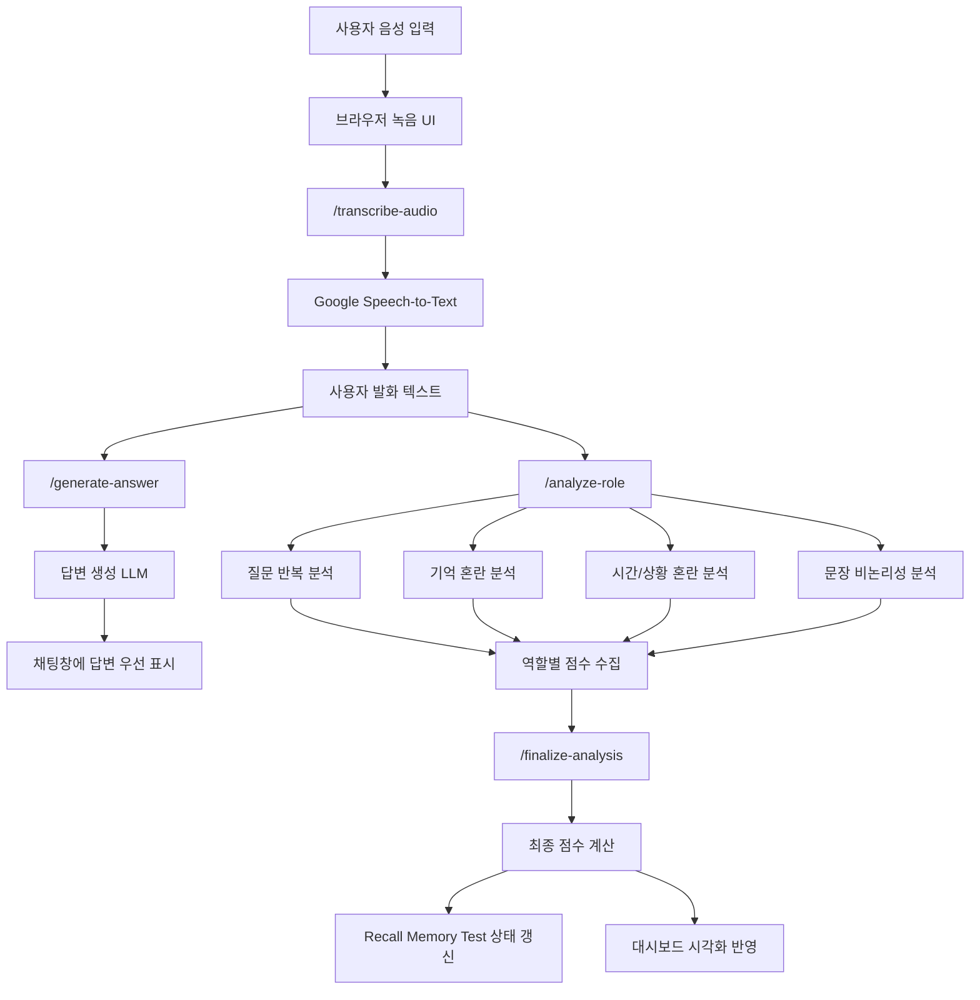

<p align="center">
  
</p>

# 대화하며 진단하는 치매 케어 AI "Dr.지누"

Dr.지누는 대화형 음성 인터페이스를 통해 인지 위험 신호를 분석하고 시각화하는 치매 케어 AI 시스템이다.  
경상국립대학교 기업형 캡스톤디자인 프로젝트로 개발되었으며, 음성 입력, STT, AI 응답 생성, 역할별 언어 특징 분석, 기억 회상 테스트, 대시보드 시각화를 하나의 사용자 경험으로 통합한다.

<p align="center">
  <a href="https://youtu.be/DrihQEexQAg">
    
  </a>
</p>

> 시연 영상: [Dr.지누 Demo Video](https://youtu.be/DrihQEexQAg)

---

## Why Dr.지누

인지 변화는 병원 안에서만 드러나지 않는다.  
오히려 일상적인 대화 속에서 질문을 반복하거나, 최근 정보를 바로 떠올리지 못하거나, 시간과 상황을 혼동하는 식의 작은 언어적 신호로 먼저 나타나는 경우가 많다.

Dr.지누는 이 지점을 출발점으로 삼는다.  
사용자의 음성 발화를 자연스럽게 받아들이고, 대화 흐름은 유지한 채 언어적 특징을 역할별로 분석하여 인지 위험 신호를 직관적인 대시보드 형태로 보여준다.  
단순한 챗봇이 아니라, 대화와 기록, 분석과 시각화를 하나의 흐름으로 연결한 관찰형 케어 인터페이스를 목표로 한다.

---

## Team

본 프로젝트는 경상국립대학교 캡스톤디자인 NCAI 팀이 수행한 결과물이다.  
음성 인식, 언어 분석, 프론트엔드 대시보드, 세션 기반 모니터링 구조를 하나의 시스템으로 통합하는 데 초점을 두고 협업하였다.

| 이름       | Role                                                             |
| ---------- | ---------------------------------------------------------------- |
| **김도윤** | Web Frontend · Backend Development                               |
| **조재민** | Mobile Application Development · Database Design                 |
| **김우성** | Robotics Implementation · Documentation · Performance Validation |
| **안재영** | Robotics Implementation · Prompt Engineering                     |

---

## Product Overview

Dr.지누는 웹 기반 음성 인터페이스에서 시작한다.  
사용자는 별도의 복잡한 조작 없이 음성으로 질문하거나 대화를 이어갈 수 있고, 시스템은 이를 텍스트로 변환한 뒤 먼저 자연스러운 답변을 생성한다. 이후 동일한 발화를 바탕으로 질문 반복, 기억 혼란, 시간·상황 혼란, 문장 비논리성을 역할별로 분석하고, 그 결과를 점수와 카드, 차트, 세션 기록 형태로 정리한다.

이 시스템은 결과를 한 번 보여주고 끝나는 구조가 아니다.  
최신 분석 결과와 누적 상태를 함께 제시하고, 과거 대화를 다시 열람할 수 있으며, 기억 회상 테스트를 세션 흐름 안에 자연스럽게 삽입해 보다 입체적인 관찰 경험을 제공한다.

### What makes it different

- 음성 입력부터 분석 결과 시각화까지 하나의 대시보드 안에서 연결된다.
- 답변 생성과 위험도 분석 흐름을 분리해 사용자 체감 속도를 높였다.
- 언어 특징을 역할별로 분석해 최종 점수가 어떤 신호에서 형성되었는지 구조적으로 설명한다.
- 채팅 기록, 세션 요약, 리포트, 기억 회상 테스트를 결합해 단순 응답형 AI를 넘어선 관찰형 시스템으로 확장하였다.

---

## Core Features

### Voice-first interaction

- 브라우저 환경에서 음성을 녹음하고 Google Speech-to-Text 기반으로 텍스트를 생성한다.
- 텍스트 변환 이후 LLM 기반 응답을 먼저 제공해 대화 흐름을 자연스럽게 유지한다.

### Role-based analysis

- 질문 반복
- 기억 혼란
- 시간·상황 혼란
- 문장 비논리성

각 항목은 분리된 분석 흐름으로 계산되며, 최종 점수는 역할별 결과를 수집해 확정한다.

### Monitoring dashboard

- 누적 위험 상태 카드
- 최신 반영 점수와 추세
- 세부 분석 카드와 근거
- 차트 기반 점수 흐름
- 과거 턴 재확인 기능

### Session tracking

- 세션 단위 기록 누적
- Recall Memory Test 자동 삽입
- 세션 리포트 모달 및 출력
- 로컬 모델 / API 모드 전환 지원

---

## System Architecture



### Architectural Intent

시스템의 핵심은 `대화 응답`과 `위험 신호 분석`을 하나의 경험 안에서 분리 운영하는 데 있다.  
사용자는 먼저 답변을 받아 대화 흐름이 끊기지 않도록 하고, 분석은 백그라운드에서 역할별로 진행되어 최종적으로 시각화된다.

- 음성은 STT를 통해 텍스트로 변환된다.
- 동일한 텍스트는 답변 생성과 역할별 분석으로 분기된다.
- 역할별 점수는 최종 집계 단계에서 수집된다.
- 결과는 세션 상태, 회상 테스트, 차트, 세부 카드에 동기화되어 반영된다.

---

## How It Works

1. 사용자가 `녹음 시작` 버튼을 눌러 발화를 입력한다.
2. 브라우저는 음성 데이터를 서버로 전송하고, 서버는 이를 텍스트로 변환한다.
3. 변환된 텍스트는 먼저 답변 생성 체인에 전달되며, 생성된 응답이 채팅창에 우선 표시된다.
4. 같은 발화는 백그라운드에서 역할별 분석 체인으로 전달된다.
5. 질문 반복, 기억 혼란, 시간·상황 혼란, 문장 비논리성 점수가 순차적으로 계산된다.
6. 모든 점수가 수집되면 최종 점수가 확정되고, 누적 상태와 차트, 세션 요약이 함께 갱신된다.
7. 세션 흐름에 따라 Recall Memory Test가 개입되며, 회상 상태 역시 별도 카드에 반영된다.
8. 사용자는 과거 채팅을 선택해 해당 시점의 분석 결과를 다시 확인할 수 있다.

---

## Role-based Analysis Framework

| 분석 항목      | 설명                                       | 점수 범위 |
| -------------- | ------------------------------------------ | --------- |
| 질문 반복      | 유사하거나 동일한 질문의 재등장 여부 확인  | 0 ~ 25    |
| 기억 혼란      | 최근 정보 회상 실패, 기억 공백 표현 분석   | 0 ~ 25    |
| 시간/상황 혼란 | 시간, 일정, 날짜, 현재 상황 혼동 여부 분석 | 0 ~ 30    |
| 문장 비논리성  | 문장 연결 불안정, 맥락 붕괴 여부 분석      | 0 ~ 20    |

### Final Scoring

```text
최종 점수 = 질문 반복 + 기억 혼란 + 시간/상황 혼란 + 문장 비논리성
```

### Risk Levels

- 0 ~ 19점: 정상
- 20 ~ 39점: 낮은 위험
- 40 ~ 59점: 주의 관찰
- 60 ~ 79점: 높은 위험
- 80 ~ 100점: 매우 높은 위험

---

## Interface

### Product Flow

Dr.지누의 인터페이스는 `좌측 요약 패널`, `중앙 대화·처리 패널`, `우측 분석 패널`의 3열 구조를 기반으로 한다.  
사용자는 중앙에서 입력과 응답을 경험하고, 좌측에서 누적 상태를, 우측에서 최신 분석 결과와 기록 흐름을 동시에 확인할 수 있다.

| 메인 인터페이스                                                                                | 음성 입력 상태                                                             |
| ---------------------------------------------------------------------------------------------- | -------------------------------------------------------------------------- |
|                                                       |                       |
| 좌·중·우 패널이 균형 있게 배치된 기본 화면으로, 누적 상태와 최신 분석을 한눈에 확인할 수 있다. | 사용자의 음성을 수집하는 동안 녹음 상태와 처리 흐름이 단계적으로 반영된다. |

| 분석 반영 단계                                                                                   | 최종 분석 결과                                                                                          |
| ------------------------------------------------------------------------------------------------ | ------------------------------------------------------------------------------------------------------- |
|                                           |                                               |
| 답변이 먼저 제시된 뒤 역할별 점수가 순차적으로 누적되며 우측 결과 패널이 함께 갱신되는 단계이다. | 최신 점수, 위험도, 추세, 세부 분석 카드가 모두 반영되어 세션 상태를 종합적으로 확인할 수 있는 화면이다. |

| 기억 회상 테스트                                                                                          |
| --------------------------------------------------------------------------------------------------------- |
|                                                 |
| 대화 흐름 중 보조 평가 단계로 기억 회상 테스트가 개입되며, 언어 분석과 별도로 회상 상태를 확인할 수 있다. |

### Key Interface Cards

#### 누적 위험 상태 카드


현재 세션의 누적 위험 상태를 가장 먼저 보여주는 핵심 요약 카드다.  
위험도 단계와 보조 문구, 상태 아이콘을 함께 제시하여 전체 상태를 직관적으로 인지할 수 있도록 구성하였다.

#### 상세 지표 카드


전체 평균, 최근 5회 평균, 최신 점수, 추세, 게이지, 시간별 점수 흐름을 하나의 묶음으로 제공하는 보조 지표 영역이다.  
기본 화면에서는 접은 상태로 유지하고 필요 시 확장되도록 설계해 메인 화면의 정보 밀도를 안정적으로 제어한다.

#### 처리 단계 카드


음성 수신, 음성 인식, 답변 생성, 위험도 분석, 화면 반영의 흐름을 단계형으로 보여주는 카드다.  
역할별 분석 칩을 함께 배치해 현재 어떤 분석이 진행 중인지, 어느 점수가 먼저 반영되었는지 직관적으로 확인할 수 있도록 했다.

#### 세션 요약 카드


최신 반영 점수, 위험도, 추세, 실행 모드를 상단에서 즉시 확인할 수 있는 카드다.  
실시간 모니터링 상황에서 가장 먼저 참고하게 되는 핵심 요약 영역으로 설계하였다.

#### AI 분석 결과 카드


선택된 대화 턴 기준의 판단, 점수, 위험도, 추세, 근거를 제공하는 메인 분석 카드다.  
최신 결과 확인과 과거 턴 재확인을 모두 지원하도록 구성해 현재 상태와 이전 분석을 같은 흐름 안에서 비교할 수 있도록 했다.

#### 언어 특징 점수 분해 카드


질문 반복, 기억 혼란, 시간·상황 혼란, 문장 비논리성을 항목별 막대 그래프로 제시한다.  
최종 점수가 어떤 언어 특징에서 형성되었는지 구조적으로 설명하는 해석 카드다.

#### 분석 신뢰도 카드


현재 분석 결과의 신뢰도를 별도 카드로 제공하여, 수치 결과와 함께 해석 안정성을 보조적으로 확인할 수 있도록 했다.  
핵심 분석 카드와 자연스럽게 이어지도록 간결한 정보 구조를 유지한다.

#### 턴 타임라인 / 리포트 카드


과거 대화의 점수 흐름과 세션 리포트 진입 기능을 묶어 제공하는 기록 관리 카드다.  
세션의 변화 흐름을 확인하고, 전체 분석 내용을 리포트 형태로 정리할 수 있도록 설계하였다.

#### 기억 회상 테스트 카드


Recall Memory Test의 현재 상태, 최근 결과, 안내 문구를 표시하는 보조 평가 카드다.  
언어 기반 위험도 분석과 별도로 기억 회상 흐름을 자연스럽게 연결하는 역할을 수행한다.

---

## Expected Impact

- 일상 대화 기반의 자연스러운 인지 위험 신호 관찰 가능
- 역할별 분석 구조를 통한 결과 해석의 명확성 확보
- 차트와 카드 중심 인터페이스를 통한 직관적 전달력 강화
- 기록 관리와 모니터링 기능이 결합된 관찰형 시스템 구현

---

## Tech Stack

### Frontend

- HTML
- CSS
- JavaScript
- Chart.js

### Backend

- Python
- Flask
- Waitress
- LangChain
- llama-cpp-python

### AI / Cloud

- Google Speech-to-Text
- GGUF 기반 로컬 LLM
- 외부 API 기반 LLM 전환 구조 지원

---

## Project Structure

```text
ncai-dementia-risk-monitor/
├─ app.py
├─ requirements.txt
├─ README.md
├─ start_server.bat
├─ package.json
├─ lint.bat
├─ format.bat
├─ docs/
│  └─ images/
├─ models/
├─ ncai_app/
│  ├─ config.py
│  ├─ llm_service.py
│  ├─ analysis_service.py
│  ├─ history_service.py
│  ├─ routes.py
│  ├─ runtime.py
│  └─ common.py
├─ scripts/
├─ static/
│  ├─ script.js
│  ├─ style.css
│  └─ 3d-icons/
└─ templates/
   └─ index.html
```

---

## Getting Started

### 1. Install dependencies

```bash
pip install -r requirements.txt
npm install
```

### 2. Run the server

```bash
python app.py
```

또는

```bash
start_server.bat
```

### 3. Open the app

같은 네트워크 내 다른 기기에서는 다음 주소로 접속할 수 있다.

```text
http://서버PC_IP:5000
```
