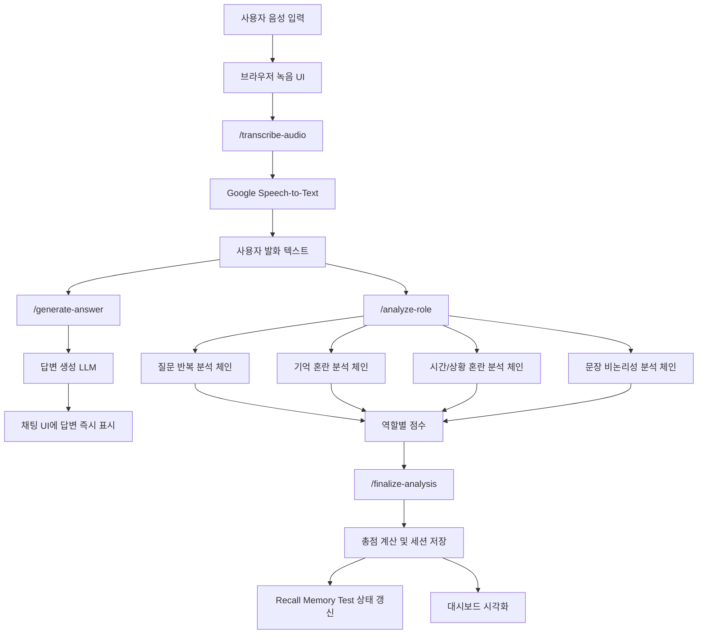
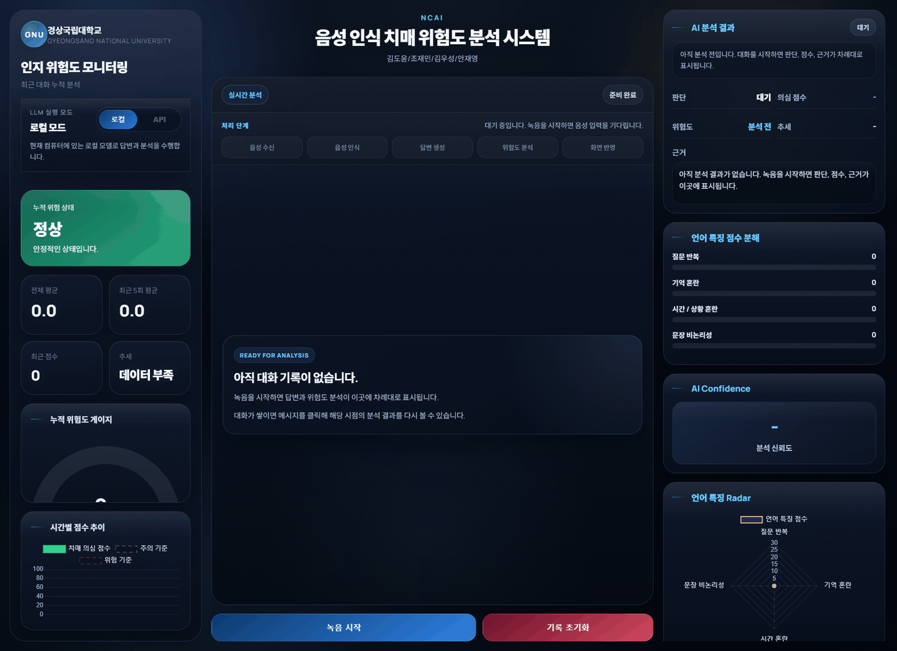

# 인지 위험도 모니터링 시스템

경상국립대학교 캡스톤디자인 프로젝트로 수행한 음성 기반 인지 위험도 모니터링 시스템입니다.  
본 시스템은 사용자의 음성 대화를 텍스트로 변환한 뒤, 언어 특징을 역할별로 분석하여 인지 저하 위험 신호를 시각적으로 제공하는 것을 목표로 합니다.

---

## 1. 과제 개요

본 과제는 사용자의 일상 대화를 바탕으로 인지 위험 신호를 조기에 관찰할 수 있는 보조형 모니터링 시스템을 구현하는 데 목적이 있습니다.

기존의 인지 관련 검사는 병원 방문 이후에 이뤄지는 경우가 많고, 설문 또는 단발성 검사에 의존하는 경우가 많습니다. 이에 따라 본 프로젝트는 보다 자연스러운 대화 환경에서 언어 특징을 분석하여, 질문 반복이나 기억 혼란과 같은 위험 신호를 정량적으로 제시할 수 있는 시스템을 설계하였습니다.

본 시스템은 다음 기능을 하나의 흐름으로 통합합니다.

- 음성 입력 및 녹음
- Speech-to-Text 기반 텍스트 변환
- 대화형 LLM 응답 생성
- 역할별 인지 위험도 분석
- Recall Memory Test 진행
- 점수 및 추세 시각화

---

## 2. 과제 필요성

인지 저하는 초기 단계에서 일상 대화 속 언어 사용 패턴에 먼저 드러날 수 있습니다. 특히 다음과 같은 현상은 중요한 관찰 요소가 됩니다.

- 이미 답을 들은 내용을 다시 묻는 질문 반복
- 최근 정보를 바로 떠올리지 못하는 기억 혼란 표현
- 시간, 날짜, 일정, 현재 상황을 혼동하는 발화
- 문장 연결이 불안정하거나 맥락이 흐트러지는 표현

본 과제는 이러한 특징을 음성 대화 기반으로 수집하고 분석함으로써, 사용자가 보다 자연스러운 환경에서 자신의 인지 상태를 모니터링할 수 있도록 하는 데 의의가 있습니다.

---

## 3. 과제 목표

- 한국어 음성 입력을 안정적으로 텍스트로 변환한다.
- 사용자 질문에 대해 자연스럽고 짧은 응답을 제공한다.
- 인지 위험과 관련된 언어 특징을 역할별로 분리 분석한다.
- 분석 결과를 점수화하고 대시보드 형태로 시각화한다.
- 세션 누적 기록을 통해 평균, 최근 변화, 추세를 제공한다.
- Recall Memory Test를 통해 단기 기억 확인 요소를 보완한다.

---

## 4. 시스템 전체 구조



### 구조 설명

- 사용자는 웹 화면에서 음성을 녹음합니다.
- 서버는 Google Speech-to-Text를 이용해 음성을 텍스트로 변환합니다.
- 변환된 텍스트는 먼저 답변 생성용 LLM으로 전달되어 사용자에게 즉시 응답이 표시됩니다.
- 이후 동일한 입력이 역할별 분석 체인으로 전달되어 질문 반복, 기억 혼란, 시간/상황 혼란, 문장 비논리성을 각각 분석합니다.
- 역할별 결과가 수집되면 최종 점수와 판정이 계산되며, 세션 기록과 대시보드에 반영됩니다.

---

## 5. 세부 수행 내용

### 5.1 음성 입력 및 STT 처리

사용자가 브라우저에서 녹음을 수행하면, 녹음된 오디오 파일이 서버로 전송됩니다. 서버는 업로드된 파일을 임시 저장한 뒤 Google Speech-to-Text API를 이용해 한국어 텍스트로 변환합니다.

### 5.2 답변 생성

텍스트로 변환된 사용자 발화는 답변 생성용 LLM에 전달됩니다. 이 단계에서는 사용자의 질문에 대해 짧고 직접적인 답변을 생성하며, 분석 결과를 기다리지 않고 우선 채팅창에 표시합니다. 이를 통해 사용자는 분석 지연과 관계없이 빠르게 응답을 확인할 수 있습니다.

### 5.3 역할별 분석

본 시스템은 인지 위험도 분석을 하나의 프롬프트에 모두 맡기지 않고, 역할별 체인으로 분리하여 수행합니다.

- 질문 반복 분석
- 기억 혼란 분석
- 시간/상황 혼란 분석
- 문장 비논리성 분석

각 분석은 독립적으로 점수를 산정하며, 결과가 도착할 때마다 그래프와 분석 카드가 즉시 갱신됩니다.

### 5.4 최종 점수 계산

역할별 점수가 모두 수집되면 총점을 계산하고 판정을 확정합니다. 이후 세션 기록에 저장하며, 평균 점수, 최근 5회 평균, 최근 점수, 추세를 함께 갱신합니다.

### 5.5 Recall Memory Test

Recall Memory Test는 일정 턴마다 자동으로 삽입됩니다.

- 사용자 발화 수가 3의 배수에 도달하면 기억 단어를 제시합니다.
- 다음 차례에서 해당 단어를 다시 묻습니다.
- 정답 여부를 기록하고 Recall 상태 카드에 반영합니다.

이를 통해 단순 언어 특징 분석 외에 단기 기억 확인 요소도 함께 제공할 수 있도록 하였습니다.

### 5.6 세션 기록 관리

시스템은 세션 단위로 다음 정보를 저장합니다.

- 사용자 발화 및 AI 응답
- 턴별 분석 결과
- 점수 히스토리
- Recall Memory Test 상태

또한 사용자가 과거 채팅을 클릭하면 해당 시점의 분석 결과를 다시 확인할 수 있도록 구현하였습니다.

---

## 6. 주요 기능

- 음성 녹음 및 업로드
- 한국어 STT 변환
- 대화형 LLM 응답 생성
- 역할별 분석 결과 즉시 반영
- 누적 위험도 점수 계산
- 추세 차트, 게이지, 레이더 차트 시각화
- Recall Memory Test 자동 진행
- 분석 제외 결과 처리
- 세션별 기록 재조회

---

## 7. 역할별 분석 구조

### 7.1 질문 반복

최근 사용자 질문과 현재 질문의 의미적 유사성을 비교하여, 동일하거나 매우 유사한 질문이 반복되는지를 분석합니다.

### 7.2 기억 혼란

“기억이 안 난다”, “까먹었다”, “잘 모르겠다”와 같은 회상 실패 표현을 중심으로 기억 혼란 여부를 평가합니다.

### 7.3 시간/상황 혼란

날짜, 시간, 일정, 수업, 회의 등 시간 및 상황과 관련된 정보를 혼동하는지를 분석합니다.

### 7.4 문장 비논리성

문장 간 연결성, 발화 흐름, 맥락 유지 여부를 바탕으로 비논리적 표현 정도를 평가합니다.

---

## 8. 점수 산정 방식

| 분석 항목      | 설명                             | 점수 범위 |
| -------------- | -------------------------------- | --------- |
| 질문 반복      | 동일하거나 유사한 질문의 재등장  | 0 ~ 25    |
| 기억 혼란      | 회상 실패 및 기억 공백 표현      | 0 ~ 25    |
| 시간/상황 혼란 | 시간, 날짜, 일정, 현재 상황 혼동 | 0 ~ 30    |
| 문장 비논리성  | 문장 연결 저하, 맥락 불안정      | 0 ~ 20    |

### 총점 계산

```text
총점 = 질문 반복 + 기억 혼란 + 시간/상황 혼란 + 문장 비논리성
```

총점 범위는 0점부터 100점입니다.

### 판정 기준

- 0 ~ 19점: 정상
- 20점 이상: 의심
- 분석 불가 또는 정보 부족: 판단 어려움

### 위험도 라벨

- 0 ~ 19점: `Normal`
- 20 ~ 39점: `Low Risk`
- 40 ~ 59점: `Moderate Risk`
- 60 ~ 79점: `High Risk`
- 80 ~ 100점: `Very High Risk`

---

## 9. 화면 구성

본 시스템의 프론트엔드는 분석 결과를 직관적으로 이해할 수 있도록 대시보드 형태로 구성하였습니다.

- 실시간 처리 단계 표시
- 채팅형 대화 인터페이스
- 누적 위험 상태 카드
- 전체 평균 / 최근 5회 평균 / 최근 점수 / 추세 카드
- 누적 위험도 게이지
- 시간별 점수 추이 그래프
- 언어 특징 점수 분해 바
- 언어 특징 레이더 차트
- AI 분석 신뢰도 카드
- Recall Memory Test 카드

또한 녹음 중에는 채팅 패널 배경에 음성 시각화가 은은하게 나타나도록 하여, 사용자가 현재 시스템 상태를 쉽게 인지할 수 있도록 하였습니다.

### 9.1 실제 동작 화면

아래 이미지는 본 시스템의 실제 동작 흐름을 문서용 데모 상태로 자동 캡처한 결과입니다.

#### 발표용 요약 시연



#### 대표 화면 구성

| 메인 대시보드                                                                    | 음성 녹음 진행                                                               |
| -------------------------------------------------------------------------------- | ---------------------------------------------------------------------------- |
|                                     |                         |
| 초기 대시보드와 누적 위험도 카드, 채팅 패널, 분석 패널이 함께 표시되는 메인 화면 | 사용자의 음성 입력이 진행되는 동안 녹음 상태와 시각적 피드백이 반영되는 화면 |

| 분석 진행 화면                                                    | 최종 분석 결과 화면                                                 |
| ----------------------------------------------------------------- | ------------------------------------------------------------------- |
|            |           |
| 답변이 먼저 제시된 뒤 역할별 분석 결과가 순차적으로 반영되는 화면 | 역할별 점수, 위험도, 추세, 신뢰도 카드가 모두 반영된 최종 결과 화면 |

| Recall Memory Test 화면                                                            |
| ---------------------------------------------------------------------------------- |
|                          |
| 일정 턴마다 기억 단어를 제시하고 다음 대화에서 회상 여부를 확인하는 보조 평가 화면 |

---

## 10. 기대 효과

- 일상 대화 기반 인지 위험 징후 탐지 가능성 제시
- 자연스러운 음성 상호작용을 통한 사용자 접근성 향상
- 언어 특징을 수치와 그래프로 보여주는 직관적 결과 제공
- 단순 챗봇이 아닌 분석형 모니터링 시스템 구현
- 조기 상담 및 추가 검사 필요성 판단을 돕는 보조 도구로 활용 가능

---

## 11. 활용 방안

- 고령자 대상 인지 상태 모니터링 보조 시스템
- 복지관, 돌봄기관, 상담기관의 1차 관찰 도구
- 대화 기반 인지 분석 연구용 프로토타입
- 음성 인식, 언어 분석, 시각화 통합 시스템의 교육용 예제

---

## 12. 프로젝트 구조

```text
ncai-dementia-risk-monitor/
├─ app.py
├─ requirements.txt
├─ README.md
├─ start_server.bat
├─ lint.bat
├─ format.bat
├─ package.json
├─ static/
│  ├─ script.js
│  └─ style.css
├─ templates/
│  └─ index.html
├─ uploads/
├─ models/
└─ ncai_app/
   ├─ __init__.py
   ├─ common.py
   ├─ config.py
   ├─ runtime.py
   ├─ llm_service.py
   ├─ analysis_service.py
   ├─ history_service.py
   └─ routes.py
```

### 파일별 역할

- `app.py`: Flask 앱 생성 및 서버 실행
- `ncai_app/config.py`: 환경설정, 경로, 프롬프트, 상수 관리
- `ncai_app/llm_service.py`: STT 및 LLM 연동
- `ncai_app/analysis_service.py`: 역할별 분석 및 점수 산정
- `ncai_app/history_service.py`: 세션, 점수, Recall 상태 관리
- `ncai_app/routes.py`: API 라우트 정의
- `static/script.js`: 프론트엔드 동작 및 차트 갱신
- `static/style.css`: UI 스타일 정의
- `templates/index.html`: 메인 화면 템플릿

---

## 13. 사용 기술

### Backend

- Python
- Flask
- Waitress

### AI / NLP

- LangChain
- LlamaCpp
- EXAONE 3.5 7.8B Instruct GGUF

### Speech

- Google Cloud Speech-to-Text

### Frontend

- HTML
- CSS
- JavaScript
- Chart.js
- MediaRecorder API

---

## 14. 실행 방법

### 14.1 의존성 설치

```bash
pip install -r requirements.txt
```

프론트엔드 포맷/검사용 도구를 함께 사용할 경우:

```bash
npm install
```

### 14.2 준비 항목

- Google Cloud Speech-to-Text 서비스 계정 키 파일
- `models/` 폴더 내부 GGUF 모델 파일

기본 모델 경로는 아래와 같습니다.

```text
models/EXAONE-3.5-7.8B-Instruct-Q8_0.gguf
```

### 14.3 서버 실행

```bash
python app.py
```

또는 Windows에서는 다음과 같이 실행할 수 있습니다.

```bash
start_server.bat
```

### 14.4 접속 주소

- 같은 PC에서 접속: `http://127.0.0.1:5000`
- 같은 네트워크의 다른 PC에서 접속: `http://서버PC_IP:5000`

예시:

```text
http://192.168.0.15:5000
```

### 14.5 코드 점검

```bash
lint.bat
```

또는

```bash
npm run lint
```

### 14.6 문서용 이미지 자동 생성

README에 포함된 화면 이미지는 데모 상태를 기준으로 자동 생성할 수 있습니다.

```bash
npm run capture:docs
```

위 명령을 실행하면 다음 파일이 자동으로 생성됩니다.

- `docs/images/01-overview.png`
- `docs/images/02-recording-state.png`
- `docs/images/03-answer-ready.png`
- `docs/images/04-analysis-progress.png`
- `docs/images/05-final-dashboard.png`
- `docs/images/06-recall-test.png`
- `docs/images/demo-flow.gif`

---

## 15. 결론

본 프로젝트는 음성 입력, STT, 대화형 LLM 응답, 역할별 언어 분석, Recall Memory Test, 세션 누적 관리, 대시보드 시각화를 하나의 시스템으로 통합하여 구현한 인지 위험도 모니터링 캡스톤 프로젝트입니다.

특히 답변 생성과 분석 과정을 분리하고, 역할별 체인을 통해 질문 반복·기억 혼란·시간/상황 혼란·문장 비논리성을 독립적으로 평가함으로써, 보다 직관적이고 설명 가능한 분석 흐름을 구현하고자 하였습니다.  
이를 통해 일상 대화 기반 인지 위험 모니터링 시스템의 가능성을 제시하는 데 의미가 있습니다.
