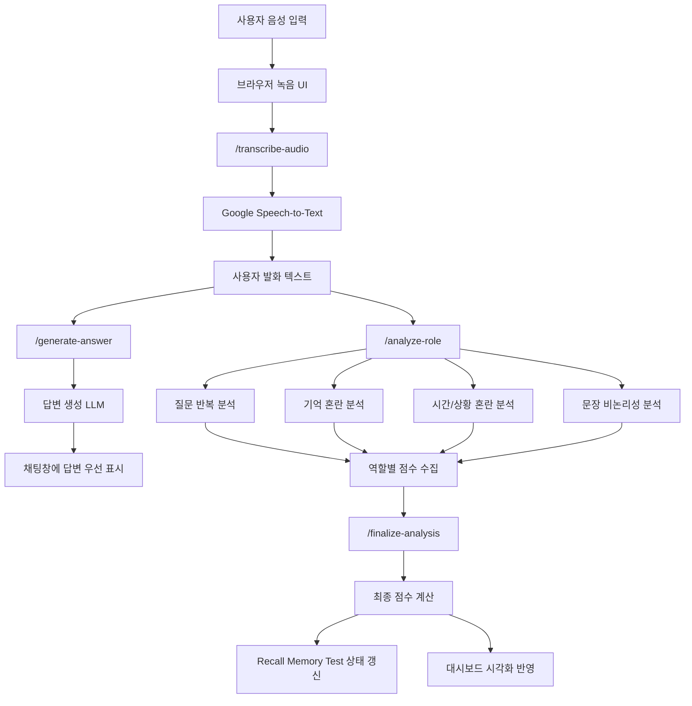

<p align="center">
  
</p>

# 음성 인식 치매 위험도 분석 시스템

경상국립대학교 NCAI 기업형 캡스톤디자인 프로젝트로 개발한 음성 기반 인지 위험도 모니터링 시스템입니다.  
사용자의 음성 발화를 텍스트로 변환한 뒤, 답변 생성과 언어 특징 분석을 분리 수행하고, 그 결과를 대시보드 형태로 시각화하여 제공합니다.

---

## 1. 프로젝트 개요

본 프로젝트는 일상 대화에서 나타나는 언어적 특징을 바탕으로 인지 위험 신호를 보조적으로 관찰할 수 있는 웹 기반 시스템을 구현하는 것을 목표로 합니다.

기존의 인지 관련 평가는 병원 방문 이후에 이뤄지거나 별도의 검사 상황에 의존하는 경우가 많습니다. 본 시스템은 보다 자연스러운 음성 상호작용 환경에서 질문 반복, 기억 혼란, 시간·상황 혼란, 문장 비논리성과 같은 특징을 역할별로 분석하고, 이를 직관적인 화면 구성으로 제시합니다.

---

## 2. 개발 배경 및 필요성

- 음성 대화는 사용자의 자연스러운 언어 사용 패턴을 반영합니다.
- 인지 변화는 질문 반복, 최근 정보 회상 실패, 일정 및 시간 혼동 등의 언어적 징후로 먼저 드러날 수 있습니다.
- 분석 결과를 수치와 시각 요소로 함께 제공하면 상태 변화를 보다 쉽게 이해할 수 있습니다.
- 단순 질의응답형 챗봇이 아니라 기록과 모니터링 기능이 결합된 형태의 시스템이 필요합니다.

---

## 3. 개발 목표

- 브라우저 환경에서 음성을 녹음하고 안정적으로 텍스트로 변환한다.
- 사용자 질문에 대해 자연스럽고 빠른 답변을 우선 제공한다.
- 질문 반복, 기억 혼란, 시간·상황 혼란, 문장 비논리성을 역할별로 분리 분석한다.
- 분석 결과를 점수, 차트, 카드 UI, 추세 정보로 시각화한다.
- 세션 단위 기록과 Recall Memory Test를 결합하여 보조 모니터링 기능을 제공한다.

---

## 4. 주요 기능

- 음성 녹음 및 Google Speech-to-Text 기반 텍스트 변환
- LLM 기반 질의응답 생성
- 역할별 언어 특징 분석
- 누적 위험 상태, 평균 점수, 최근 점수, 추세 차트 시각화
- 채팅 기록 클릭을 통한 과거 분석 결과 재확인
- Recall Memory Test 자동 삽입 및 결과 표시
- 세션 리포트 모달 및 출력 기능
- 로컬 모델 / API 모드 전환 지원

---

## 5. 시스템 전체 구조



### 구조 설명

- 사용자의 음성은 브라우저에서 녹음되어 서버로 전달됩니다.
- 서버는 Google Speech-to-Text를 이용해 음성을 텍스트로 변환합니다.
- 변환된 텍스트는 먼저 답변 생성 체인으로 전달되어 채팅창에 빠르게 응답을 제공합니다.
- 이후 동일한 입력을 질문 반복, 기억 혼란, 시간·상황 혼란, 문장 비논리성의 네 가지 역할별 분석 체인으로 분리하여 점수를 산출합니다.
- 최종 점수는 세션 기록, 위험도 상태 카드, 차트, 세부 분석 카드에 반영됩니다.

---

## 6. 상세 동작 흐름

1. 사용자가 `녹음 시작` 버튼을 눌러 음성을 입력합니다.
2. 서버는 업로드된 음성을 텍스트로 변환합니다.
3. 답변 생성 모델이 질문에 대한 응답을 먼저 생성하여 채팅창에 표시합니다.
4. 백그라운드에서 역할별 분석 체인이 순차적으로 점수를 계산합니다.
5. 최종 점수가 확정되면 누적 위험 상태, 세션 요약, 차트, 세부 분석 카드가 갱신됩니다.
6. 일정 흐름에 따라 Recall Memory Test가 자동으로 삽입됩니다.
7. 사용자는 과거 채팅을 클릭하여 해당 시점의 분석 결과를 다시 확인할 수 있습니다.

---

## 7. 역할별 분석 구조

| 분석 항목      | 설명                                       | 점수 범위 |
| -------------- | ------------------------------------------ | --------- |
| 질문 반복      | 유사하거나 동일한 질문의 재등장 여부 확인  | 0 ~ 25    |
| 기억 혼란      | 최근 정보 회상 실패, 기억 공백 표현 분석   | 0 ~ 25    |
| 시간/상황 혼란 | 시간, 일정, 날짜, 현재 상황 혼동 여부 분석 | 0 ~ 30    |
| 문장 비논리성  | 문장 연결 불안정, 맥락 붕괴 여부 분석      | 0 ~ 20    |

### 총점 계산 방식

```text
최종 점수 = 질문 반복 + 기억 혼란 + 시간/상황 혼란 + 문장 비논리성
```

### 위험도 구간

- 0 ~ 19점: 정상
- 20 ~ 39점: 낮은 위험
- 40 ~ 59점: 주의 관찰
- 60 ~ 79점: 높은 위험
- 80 ~ 100점: 매우 높은 위험

---

## 8. 화면 구성

### 8.1 화면 예시

| 메인 화면                                                          | 녹음 진행                                                |
| ------------------------------------------------------------------ | -------------------------------------------------------- |
|                           |     |
| 전체 대시보드, 채팅 영역, 분석 패널이 함께 보이는 기본 화면입니다. | 음성 입력 중 상태 변화와 시각화가 활성화되는 화면입니다. |

| 분석 진행                                                          | 최종 결과                                                         |
| ------------------------------------------------------------------ | ----------------------------------------------------------------- |
|             |         |
| 답변이 먼저 표시된 뒤 역할별 분석 점수가 순차 반영되는 장면입니다. | 최종 점수, 위험도, 추세, 세부 분석 카드가 모두 반영된 상태입니다. |

| Recall Memory Test                                                 |
| ------------------------------------------------------------------ |
|          |
| 세션 흐름에 따라 기억 회상 테스트가 표시되는 보조 평가 화면입니다. |

### 8.2 카드별 화면 설명

#### 1. 누적 위험 상태 카드


현재 세션의 누적 위험 상태를 가장 먼저 보여주는 핵심 카드입니다.  
상태명과 보조 설명을 함께 제시하여 전체 상태를 즉시 파악할 수 있도록 구성했습니다.

#### 2. 상세 지표 카드


전체 평균, 최근 5회 평균, 최근 점수, 추세, 게이지, 시간별 점수 흐름을 묶어 보여주는 보조 지표 영역입니다.  
기본 화면에서는 접어 두고 필요할 때만 펼치도록 구성하여 화면 복잡도를 줄였습니다.

#### 3. 처리 단계 카드


음성 수신, 음성 인식, 답변 생성, 위험도 분석, 화면 반영의 흐름을 단계별로 보여줍니다.  
역할별 분석 칩을 함께 표시하여 현재 어떤 분석이 진행 중인지 직관적으로 확인할 수 있습니다.

#### 4. 세션 요약 카드


최신 반영 점수, 위험도, 추세, 실행 모드를 상단에서 바로 요약해 주는 카드입니다.  
실시간 모니터링 화면에서 가장 빠르게 결과를 이해할 수 있는 요약 영역입니다.

#### 5. AI 분석 결과 카드


선택된 대화 턴에 대한 판단, 점수, 위험도, 추세, 근거를 보여줍니다.  
사용자가 과거 대화를 클릭했을 때 해당 시점의 분석 내용을 다시 확인할 수 있도록 설계했습니다.

#### 6. 언어 특징 점수 분해 카드


질문 반복, 기억 혼란, 시간·상황 혼란, 문장 비논리성의 세부 점수를 막대 형태로 분리해 보여줍니다.  
최종 점수가 어떤 항목에서 형성되었는지 설명하는 핵심 카드입니다.

#### 7. 분석 신뢰도 카드


현재 분석 결과의 신뢰도를 별도 카드로 제시합니다.  
세부 분석과 함께 읽을 수 있도록 간결하고 안정적인 정보 구조로 구성했습니다.

#### 8. 턴 타임라인 / 리포트 카드


과거 대화의 점수 흐름과 세션 리포트 진입 영역을 묶은 카드입니다.  
세션의 변화 흐름을 확인하고, 리포트 기능으로 전체 분석을 정리할 수 있도록 구성했습니다.

#### 9. 기억 회상 테스트 카드


Recall Memory Test의 현재 상태, 최근 결과, 안내 문구를 표시합니다.  
일반 언어 분석과 함께 회상 과정을 보조적으로 확인할 수 있도록 설계했습니다.

---

## 9. 기대 효과

- 일상 대화 기반의 자연스러운 인지 위험 신호 관찰 가능
- 역할별 분석 구조를 통한 직관적인 결과 해석 지원
- 차트와 카드 중심 대시보드를 통한 시각적 전달력 강화
- 기록 관리와 모니터링 기능이 결합된 시스템 구현

---

## 10. 기술 스택

### Frontend

- HTML
- CSS
- JavaScript
- Chart.js

### Backend

- Python
- Flask
- Waitress
- LangChain
- llama-cpp-python

### AI / Cloud

- Google Speech-to-Text
- GGUF 기반 로컬 LLM
- 외부 API 기반 LLM 전환 구조 지원

---

## 11. 프로젝트 구조

```text
ncai-dementia-risk-monitor/
├─ app.py
├─ requirements.txt
├─ README.md
├─ start_server.bat
├─ package.json
├─ lint.bat
├─ format.bat
├─ docs/
│  └─ images/
├─ models/
├─ ncai_app/
│  ├─ config.py
│  ├─ llm_service.py
│  ├─ analysis_service.py
│  ├─ history_service.py
│  ├─ routes.py
│  ├─ runtime.py
│  └─ common.py
├─ scripts/
│  └─ capture-demo.mjs
├─ static/
│  ├─ script.js
│  ├─ style.css
│  └─ 3d-icons/
└─ templates/
   └─ index.html
```

---

## 12. 실행 방법

### 1. 패키지 설치

```bash
pip install -r requirements.txt
npm install
```

### 2. 서버 실행

```bash
python app.py
```

또는

```bash
start_server.bat
```

### 3. 접속

같은 네트워크 내 다른 기기에서는 다음 주소로 접속할 수 있습니다.

```text
http://서버PC_IP:5000
```

---

## 13. 팀 구성

- 김도윤
- 조재민
- 김우성
- 안재영
